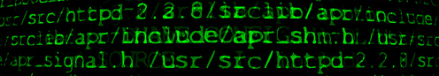

<h1 align="center"> Decodificador de Mensagem </h1>

Este projeto é uma aplicação web simples que permite a criptografia e descriptografia de mensagens. O objetivo é proporcionar uma maneira fácil e rápida de codificar mensagens utilizando regras básicas de substituição de caracteres.

<h2>Funcionalidades:</h2>
<strong>Criptografia de Mensagens:</strong>  Codifique uma mensagem utilizando uma chave de substituição personalizada. Digite sua mensagem no local indicado e clique em 'Criptografar'. 
<strong>Descriptografia de Mensagens:</strong>  Decodifique mensagens previamente criptografadas. Copie o texto criptografado e cole no mesmo local onde digitou a mensagem inicialmente e clique em 'Descriptografar". 
<strong>Copiar Mensagem</strong>:  Copie o resultado da criptografia/descriptografia para a área de transferência com um único clique. 
<strong>Limpar Mensagem:</strong>  Limpe os campos de entrada e saída para começar uma nova criptografia/descriptografia. 
<h2>Tecnologias Utilizadas:</h2>

<h2>Acesse:</h2> https://decodificador-de-mensagem.vercel.app/
<h2>Como Usar:</h2>
Pré-requisitos
Para executar este projeto, você precisará de um navegador web moderno. Não são necessárias instalações adicionais.

Passos para Usar
1. Clone o Repositório:

2. Abra o Arquivo index.html:
Navegue até o diretório do projeto e abra o arquivo index.html em seu navegador.

3.Digite Sua Mensagem:
Na área de texto "Digite sua mensagem", insira o texto que você deseja criptografar ou descriptografar.

4.Clique em Criptografar ou Descriptografar:
Utilize os botões correspondentes para criptografar ou descriptografar a mensagem.

5.Copiar ou Limpar:
Use os botões de copiar para transferir o texto criptografado/descriptografado para a área de transferência ou o botão limpar para resetar os campos.

<h2>Exemplo de Uso:</h2>
Aqui está um exemplo de como o aplicativo pode ser utilizado:

Insira a mensagem "ola mundo". 
Clique em "Criptografar". 
A mensagem criptografada será exibida, por exemplo, "plb nqzcp". 
Clique em "Copiar" para copiar a mensagem criptografada. 
Personalização
Você pode personalizar as regras de criptografia/descriptografia modificando a lógica em script.js.

<h2>Estrutura do Projeto</h2>

├── index.html 
├── css 
│   └── style.css 
├── js 
│   └── script.js 
└── README.md 

<h3>index.html:</h3> Contém a estrutura HTML da aplicação.
<h3>style.css:</h3> Contém o estilo CSS que define o layout e a aparência da aplicação.
<h3>script.js:</h3> Contém a lógica JavaScript para criptografia, descriptografia, copiar e limpar mensagens.
<h2>Contribuindo</h2>
Contribuições são bem-vindas! Se você deseja melhorar este projeto, siga os passos abaixo: 

Faça um fork do repositório. 

Crie uma nova branch: git checkout -b minha-feature. 

Faça suas alterações e commit: git commit -m 'Minha nova feature'. 

Envie para o seu fork: git push origin minha-feature. 

Envie um pull request. 

<h2>Desenvolvido por:</h2>

Fabiana Cortello

